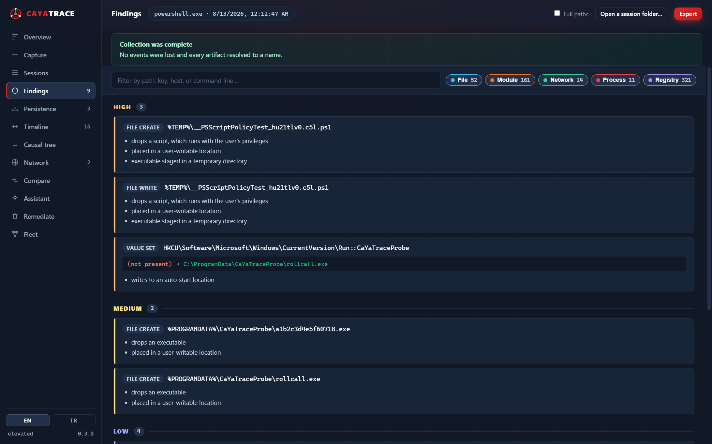
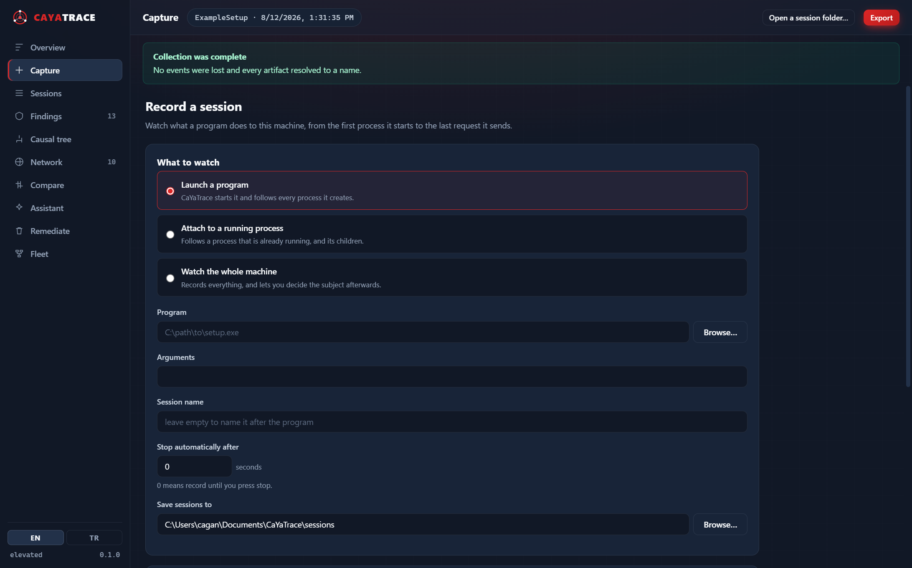
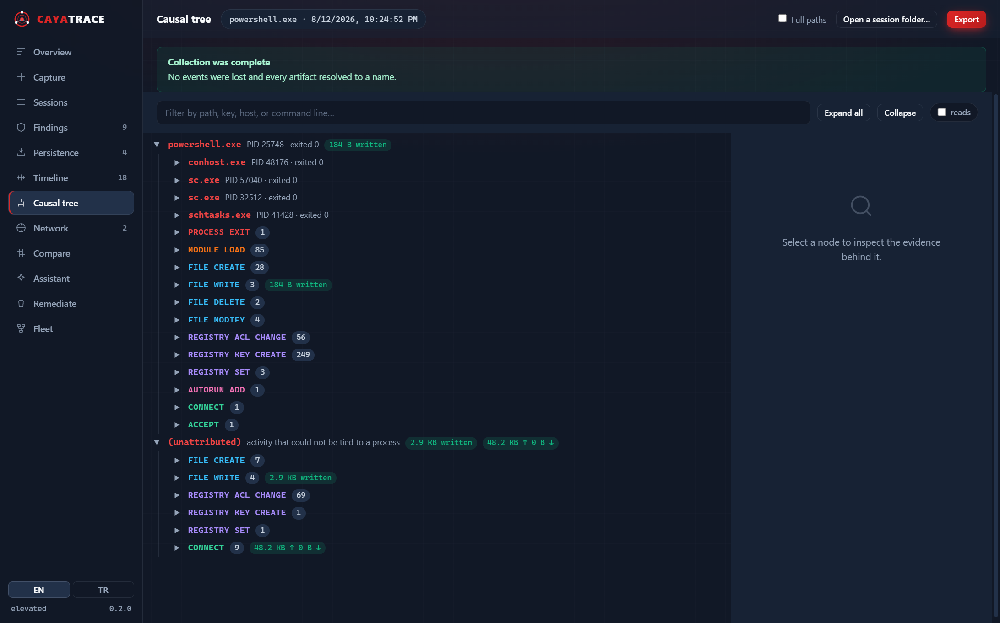
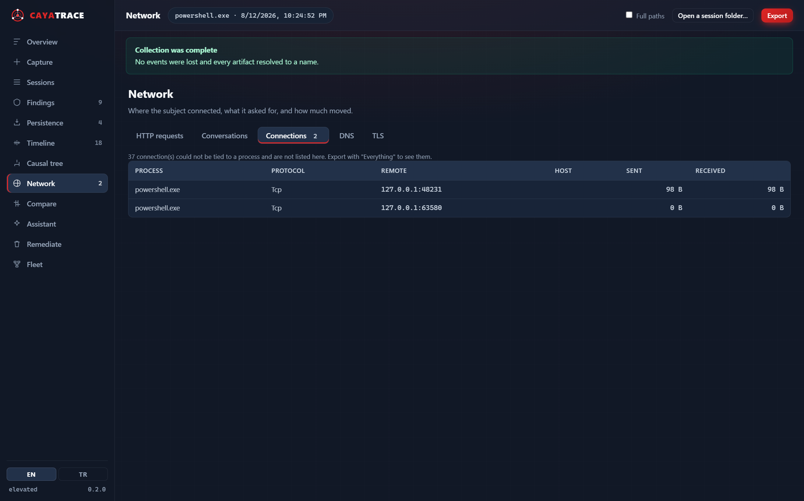
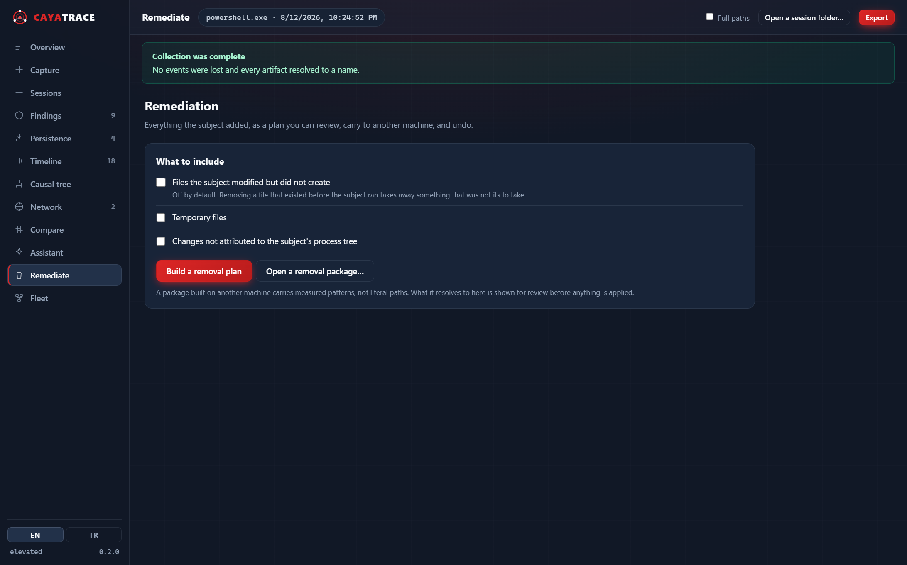
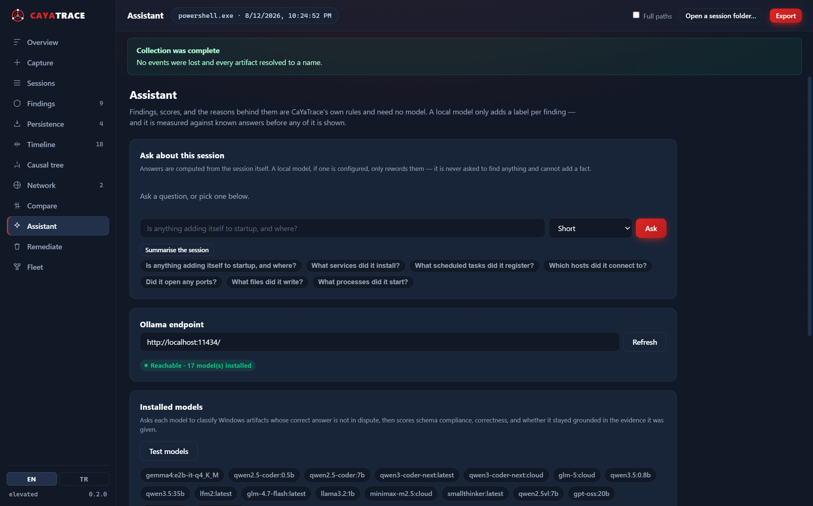
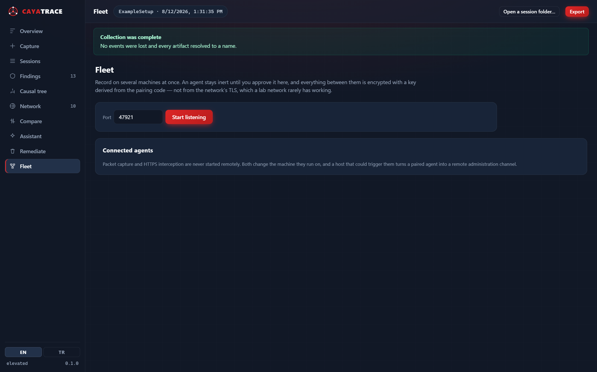
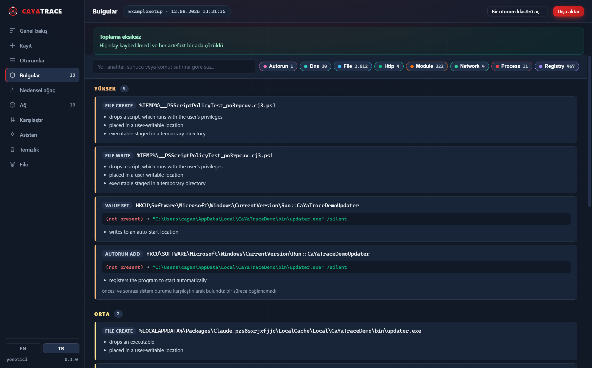

<div align="center">

# CaYaTrace

**Windows application forensics — see exactly what a program does to your machine and to the network.**

[](LICENSE)
[](#requirements)
[](#requirements)
[](docs/ROADMAP.md)

[Türkçe README](README.tr.md) · [Architecture](docs/ARCHITECTURE.md) · [Security](SECURITY.md) · [Roadmap](docs/ROADMAP.md)

</div>

---

> [!WARNING]
> **Authorized use only.** Captured sessions can contain passwords, tokens, cookies, full
> URLs, request and response bodies, file contents, usernames, and other sensitive data. Use
> this only on systems you own or are explicitly authorized to test. Never commit a session
> to a public repository. See [SECURITY.md](SECURITY.md).

---

## What it does

Install monitors show you *what changed*. Network sniffers show you *what was sent*.
CaYaTrace joins the two into a single causal chain, so you can follow one thread from a
double-click all the way to an HTTPS request:

```
setup.exe
├─ msiexec.exe
│   ├─ FILE CREATE
│   │   └─ %PROGRAMFILES%\Example\example.exe
│   ├─ REGISTRY SET
│   │   └─ HKLM\...\Uninstall\Example::DisplayName
│   │       from: (not present)
│   │       to:   Example 2.1
│   └─ SERVICE CREATE
│       └─ ExampleService
│
└─ example.exe
    ├─ FILE CREATE
    │   └─ %APPDATA%\Example\config.json
    ├─ DNS
    │   └─ api.example.com
    └─ HTTP(S)
        └─ POST https://api.example.com/v3/register
            ├─ Request metadata
            ├─ Response metadata
            └─ 1.7 KB sent / 4.2 KB received
```

Then it turns that recording into a **portable removal package** you can carry to a machine
that has never run CaYaTrace and clean it there — with every item re-verified against that
machine before anything is touched.

## Why it is built the way it is

- **Correct attribution over more events.** PIDs get recycled; file and registry events carry
  pointers, not names. Getting these wrong produces a confident, *wrong* tree. See
  [the correlation layer](docs/ARCHITECTURE.md#3-the-correlation-layer-is-the-product).
- **Honest about what it missed.** ETW drops events silently under load, which makes a session
  look *cleaner* than reality. Every session reports its own data quality.
- **No kernel driver.** No install, no reboot, no test-signing mode, nothing left behind.
  [Why, and what it costs.](docs/ARCHITECTURE.md#1-the-constraint-that-shapes-everything-no-kernel-driver)
- **Removal that cannot brick the machine.** Non-overridable deny list, fingerprint
  verification, quarantine instead of delete, rollback journal, dry run by default.

## Status — 0.4.0 preview

This is an early release. What is real today versus designed is tracked honestly:

| Area | Status |
|---|---|
| Process / thread / module tracing, causal tree | ✅ working |
| File and registry tracing with name resolution | ✅ working |
| Registry before → after value transitions | ✅ working |
| Before/after system inventories + diff | ✅ working |
| Network flows with process attribution (kernel) | ✅ working |
| DNS queries and answers, attributed to the requesting process | ✅ working |
| TLS handshake metadata (Schannel) | ✅ working |
| Full URLs from WinINet / WinHTTP applications | ✅ working |
| Session storage, JSONL journal, data-quality reporting | ✅ working |
| Removal planner, `.ctpkg` packages, remediation runner | ✅ working |
| CLI (`trace`, `report`, `remediate`, `compare`, `explain`, `agent`) | ✅ working |
| Workbench UI (WebView2 + CaYaDev theme) | ✅ working |
| Packet capture via Pktmon, correlated to processes | ✅ working |
| Intercepting proxy for full request bodies (opt-in) | ✅ working |
| Multi-VM comparison (`compare`) with measured path templating | ✅ working |
| Fleet transport: paired, encrypted host ↔ agent channel | ✅ working |
| Risk scoring with visible reasons | ✅ working |
| Ollama integration with model capability testing | ✅ working |
| VirusTotal reputation (hash lookup, never uploads) | ✅ working |
| HTML / JSON / CSV / text export with category and depth selection | ✅ working |
| Turkish and English interface, following the system language | ✅ working |
| Persistence: every mechanism a program uses to run again, with what it configured | ✅ working |
| Process timeline: what ran, for how long, under which parent, and what it touched | ✅ working |
| Conversation contents reassembled from packets, split by local network vs internet | ✅ working |
| Ask the session: answers computed from the recording; a model may compare and rank, never invent | ✅ working |
| Chat that follows a conversation, narrows to the thing you named, and builds one grounded command | ✅ working |
| Web lookups from the chat for an unfamiliar name, off unless switched on | ✅ working |
| Machine changes undone on the next launch even when the session was killed | ✅ working |
| Removal progress, self-protection disarming, and quarantine keep/restore/delete | ✅ working |
| Fleet: join from the window, per-machine live view, remote stop of a process or service | ✅ working |
| Conversations between processes on this machine, with the program at each end | ✅ working |

## The workbench

Everything below is driven from one window. Nothing here needs the command line.



Findings lead, because they answer the question an analyst opens a session with.
Every one carries the rules that produced it, and a registry change shows what the
value was before and what it became.

<table>
<tr>
<td width="50%"><a href="docs/images/workbench-capture.png"></a><br><b>Capture</b> — launch a program, attach to a running one, or watch the whole machine.</td>
<td width="50%"><a href="docs/images/workbench-tree.png"></a><br><b>Causal tree</b> — process → child → module → file → registry → service → connection → request.</td>
</tr>
<tr>
<td><a href="docs/images/workbench-network.png"></a><br><b>Network</b> — which process asked for which URL, with status and bytes.</td>
<td><a href="docs/images/workbench-remediate.png"></a><br><b>Remediation</b> — review what would be removed before anything is touched.</td>
</tr>
<tr>
<td><a href="docs/images/workbench-assistant.png"></a><br><b>Assistant</b> — a local model, measured against known answers before it is believed.</td>
<td><a href="docs/images/workbench-fleet.png"></a><br><b>Fleet</b> — record on several machines; an agent is inert until you approve it.</td>
</tr>
</table>

The interface follows the system language. Same session, Turkish Windows:




## Quick start

Download `CaYaTrace.exe` from [Releases](https://github.com/CaYatur/CaYaTrace/releases). It is
portable — one file, no installer, no service, nothing written outside its own folder and the
session directory you choose.

**Run it with no arguments** and the workbench opens. Choose a program on the Capture tab,
press record, use the program the way a user would, then press stop. Everything else —
findings, the causal tree, network activity, export, removal — is in that window.

For scripting and sandbox automation, every capability is also a verb:

```bash
CaYaTrace trace --target "C:\Downloads\setup.exe" --duration 120
```

Render what it found, as a tree, as JSON, as a spreadsheet, or as a report you can email:

```bash
CaYaTrace report --session .\sessions --format html --out report.html
```

Build a removal package from the recording:

```bash
CaYaTrace report --session .\sessions --export-package Example.ctpkg
```

Preview the removal on any machine (nothing is changed without `--apply`):

```bash
CaYaTrace remediate --package Example.ctpkg
```

Record the same program on two VMs, then compare — the parts that recur are its real
behaviour, and the paths that differ become *measured* patterns the package carries:

```bash
CaYaTrace compare .\vm-a .\vm-b --export-package Example.ctpkg
```

Rank and explain a session, optionally with a local model:

```bash
CaYaTrace explain --session .\sessions --check-models
```

Run `CaYaTrace help` for every option.

> **Kernel tracing needs an elevated prompt.** Without it CaYaTrace still records
> before/after system inventories, and tells you clearly what it skipped rather than
> pretending the program did nothing.

## Requirements

- Windows 10 (1809+) or Windows 11, x64 or ARM64
- Administrator rights for kernel tracing — everything else works unelevated
- [WebView2 runtime](https://developer.microsoft.com/microsoft-edge/webview2/) for the
  workbench UI (preinstalled on Windows 11; the CLI does not need it)

## Building from source

Requires the [.NET 8 SDK](https://dotnet.microsoft.com/download).

```bash
git clone https://github.com/CaYatur/CaYaTrace.git
cd CaYaTrace
dotnet test
dotnet publish src/CaYaTrace.App -c Release -r win-x64 -o dist
```

Trimming is disabled deliberately —
[here is why](docs/ARCHITECTURE.md#9-packaging).

## Language

The interface follows the Windows display language: Turkish on a Turkish system, English
everywhere else. Override it for one run with `--lang en` or `--lang tr`, for a shell with
`CAYATRACE_LANGUAGE`, or permanently with the EN/TR switch in the workbench.

An exported HTML report carries both languages and its own switch, so a colleague reads it in
theirs rather than in the language of whoever recorded it.

Operation names in the tree (`FILE CREATE`, `REGISTRY SET`) stay in English in every
language, so reports remain diffable and searchable across locales.

## Documentation

| | |
|---|---|
| [Architecture](docs/ARCHITECTURE.md) | How the engine works, and the limits it has |
| [Package format](docs/PACKAGE-FORMAT.md) | The `.ctpkg` removal package |
| [Roadmap](docs/ROADMAP.md) | What is planned, in what order |
| [Security](SECURITY.md) | Handling captured evidence; reporting vulnerabilities |
| [Contributing](CONTRIBUTING.md) | |

## Related

[CaYa Network Forensic Observer](https://github.com/CaYatur/CaYa-Network-Forensic-Observer) —
the network-only predecessor. CaYaTrace supersedes it by adding system-change tracing, causal
correlation, and remediation.

## License

MIT © 2026 [CaYatur](https://github.com/CaYatur) · [CaYaDev](https://cayadev.com)
