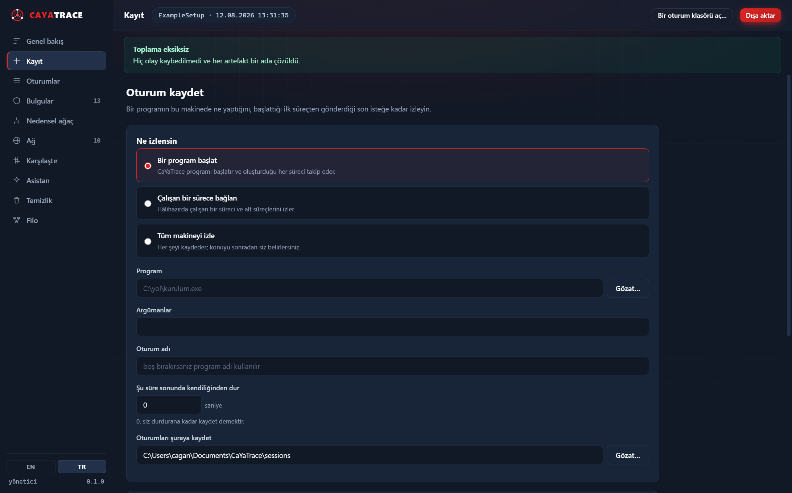

<div align="center">

# CaYaTrace

**Windows uygulama adli analizi — bir programın sisteminizde ve ağda tam olarak ne yaptığını görün.**

[](LICENSE)
[](#gereksinimler)
[](#gereksinimler)
[](docs/ROADMAP.md)

[English README](README.md) · [Mimari](docs/ARCHITECTURE.md) · [Güvenlik](SECURITY.md) · [Yol haritası](docs/ROADMAP.md)

</div>

---

> [!WARNING]
> **Yalnızca yetkili kullanım.** Kaydedilen oturumlar parolalar, oturum jetonları, çerezler,
> tam URL'ler, istek ve yanıt gövdeleri, dosya içerikleri ve kullanıcı adları gibi hassas
> veriler içerebilir. Bu aracı yalnızca size ait olan veya test etmek için açıkça yetkili
> olduğunuz sistemlerde kullanın. Bir oturumu asla herkese açık bir depoya yüklemeyin.
> Ayrıntılar: [SECURITY.md](SECURITY.md).

---

## Ne yapar

Kurulum izleyicileri size *neyin değiştiğini* gösterir. Ağ dinleyicileri *neyin
gönderildiğini* gösterir. CaYaTrace ikisini tek bir nedensel zincirde birleştirir; böylece
bir çift tıklamadan bir HTTPS isteğine kadar tek bir izi takip edebilirsiniz:

```
setup.exe
├─ msiexec.exe
│   ├─ FILE CREATE
│   │   └─ %PROGRAMFILES%\Example\example.exe
│   ├─ REGISTRY SET
│   │   └─ HKLM\...\Uninstall\Example::DisplayName
│   │       from: (yok)
│   │       to:   Example 2.1
│   └─ SERVICE CREATE
│       └─ ExampleService
│
└─ example.exe
    ├─ FILE CREATE
    │   └─ %APPDATA%\Example\config.json
    ├─ DNS
    │   └─ api.example.com
    └─ HTTP(S)
        └─ POST https://api.example.com/v3/register
            ├─ İstek meta verisi
            ├─ Yanıt meta verisi
            └─ 1.7 KB gönderildi / 4.2 KB alındı
```

Ardından bu kaydı **taşınabilir bir kaldırma paketine** dönüştürür. Bu paketi CaYaTrace'in
hiç çalışmadığı bir cihaza götürüp orada temizlik yapabilirsiniz — her madde, herhangi bir
şeye dokunulmadan önce o cihazda yeniden doğrulanır.

## Neden böyle tasarlandı

- **Daha çok olay yerine doğru ilişkilendirme.** PID'ler geri dönüştürülür; dosya ve kayıt
  defteri olayları isim değil işaretçi taşır. Bunları yanlış yapmak, kendinden emin ama
  *yanlış* bir ağaç üretir. Bkz. [ilişkilendirme katmanı](docs/ARCHITECTURE.md#3-the-correlation-layer-is-the-product).
- **Neyi kaçırdığı konusunda dürüst.** ETW yük altında olayları sessizce düşürür; bu da
  oturumu gerçekte olduğundan *daha temiz* gösterir. Her oturum kendi veri kalitesini
  raporlar.
- **Çekirdek sürücüsü yok.** Kurulum yok, yeniden başlatma yok, test imzalama modu yok,
  geride bir şey kalmıyor.
  [Nedeni ve bedeli.](docs/ARCHITECTURE.md#1-the-constraint-that-shapes-everything-no-kernel-driver)
- **Cihazı bozamayacak bir kaldırma.** Geçersiz kılınamayan yasak listesi, parmak izi
  doğrulaması, silme yerine karantina, geri alma günlüğü ve varsayılan olarak prova modu.

## Durum — 0.4.2 önizleme

Bu erken bir sürüm. Bugün gerçekten çalışan ile yalnızca tasarlanmış olan dürüstçe ayrılmıştır:

| Alan | Durum |
|---|---|
| Süreç / iş parçacığı / modül izleme, nedensel ağaç | ✅ çalışıyor |
| İsim çözümlemeli dosya ve kayıt defteri izleme | ✅ çalışıyor |
| Kayıt defteri önce → sonra değer geçişleri | ✅ çalışıyor |
| Öncesi/sonrası sistem envanteri ve farkı | ✅ çalışıyor |
| Sürece ilişkilendirilmiş ağ akışları (çekirdek) | ✅ çalışıyor |
| DNS sorguları ve yanıtları, isteyen sürece ilişkilendirilmiş | ✅ çalışıyor |
| TLS el sıkışma meta verisi (Schannel) | ✅ çalışıyor |
| WinINet / WinHTTP uygulamalarından tam URL'ler | ✅ çalışıyor |
| Oturum depolama, JSONL günlüğü, veri kalitesi raporu | ✅ çalışıyor |
| Kaldırma planlayıcı, `.ctpkg` paketleri, kaldırma motoru | ✅ çalışıyor |
| Komut satırı (`trace`, `report`, `remediate`, `compare`, `explain`, `agent`) | ✅ çalışıyor |
| Çalışma tezgâhı arayüzü (WebView2 + CaYaDev teması) | ✅ çalışıyor |
| Süreçlere ilişkilendirilmiş Pktmon paket yakalama | ✅ çalışıyor |
| Tam istek gövdeleri için araya giren proxy (isteğe bağlı) | ✅ çalışıyor |
| Çoklu VM karşılaştırması (`compare`) ve ölçülmüş yol şablonlama | ✅ çalışıyor |
| Filo aktarımı: eşleştirilmiş, şifreli host ↔ ajan kanalı | ✅ çalışıyor |
| Gerekçeleri görünür risk puanlama | ✅ çalışıyor |
| Model yeterlilik testli Ollama entegrasyonu | ✅ çalışıyor |
| VirusTotal itibar sorgusu (hash ile, asla yükleme yapmaz) | ✅ çalışıyor |
| Kategori ve derinlik seçimli HTML / JSON / CSV / metin dışa aktarma | ✅ çalışıyor |
| Sistem dilini izleyen Türkçe ve İngilizce arayüz | ✅ çalışıyor |
| Kalıcılık: bir programın tekrar çalışmak için kullandığı her yöntem ve ayarları | ✅ çalışıyor |
| Süreç zaman çizelgesi: ne çalıştı, ne kadar, hangi üst süreçle, neye dokundu | ✅ çalışıyor |
| Paketlerden yeniden kurulan konuşma içerikleri; yerel ağ ile internet ayrı | ✅ çalışıyor |
| Oturuma soru sorma: yanıtlar kayıttan hesaplanır; model karşılaştırıp sıralayabilir, uyduramaz | ✅ çalışıyor |
| Sohbeti takip eden, adını verdiğiniz şeye daraltan ve tek bir dayanaklı komut üreten asistan | ✅ çalışıyor |
| Tanımadığınız bir ad için sohbetten web araması; varsayılan olarak kapalı | ✅ çalışıyor |
| Oturum öldürülse bile makinede yapılan değişikliklerin bir sonraki açılışta geri alınması | ✅ çalışıyor |
| Kaldırma ilerlemesi, kendini koruma etkisizleştirme, karantina: tut/geri koy/sil | ✅ çalışıyor |
| Filo: pencereden katılma, makine başına canlı görünüm, uzaktan süreç/servis durdurma | ✅ çalışıyor |
| Bu makinedeki süreçler arası konuşmalar; her iki uçtaki program adıyla | ✅ çalışıyor |

## Çalışma tezgâhı

Aşağıdakilerin tamamı tek pencereden yürütülür. Hiçbiri komut satırı gerektirmez.


Bulgular başta gelir, çünkü bir analistin oturumu açarken sorduğu soru budur.
Her bulgu kendisini üreten kuralları taşır; bir kayıt defteri değişikliği ise değerin
öncesini ve sonrasını gösterir.

<table>
<tr>
<td width="50%"><a href="docs/images/workbench-capture-tr.png"></a><br><b>Kayıt</b> — bir program başlatın, çalışan birine bağlanın ya da tüm makineyi izleyin.</td>
<td width="50%"><a href="docs/images/workbench-tree.png"></a><br><b>Nedensel ağaç</b> — süreç → alt süreç → modül → dosya → kayıt defteri → servis → bağlantı → istek.</td>
</tr>
<tr>
<td><a href="docs/images/workbench-network.png"></a><br><b>Ağ</b> — hangi süreç hangi URL'yi istedi, durum kodu ve bayt sayısıyla.</td>
<td><a href="docs/images/workbench-remediate.png"></a><br><b>Temizlik</b> — hiçbir şeye dokunulmadan önce ne kaldırılacağını gözden geçirin.</td>
</tr>
<tr>
<td><a href="docs/images/workbench-assistant.png"></a><br><b>Asistan</b> — yerel bir model; güvenilmeden önce yanıtı belli sorularla ölçülür.</td>
<td><a href="docs/images/workbench-fleet.png"></a><br><b>Filo</b> — birden çok makinede kayıt; ajan siz onaylayana kadar hiçbir şey yapmaz.</td>
</tr>
</table>

Arayüz sistem dilini izler. Aynı oturum, İngilizce Windows'ta:


## Hızlı başlangıç

`CaYaTrace.exe` dosyasını [Releases](https://github.com/CaYatur/CaYaTrace/releases)
bölümünden indirin. Taşınabilirdir — tek dosya, kurulum yok, servis yok; kendi klasörü ve
sizin seçtiğiniz oturum dizini dışına hiçbir şey yazmaz.

**Argümansız çalıştırın**, çalışma tezgâhı açılır. Kayıt sekmesinden bir program seçin,
kaydı başlatın, programı bir kullanıcının kullanacağı gibi kullanın ve durdurun. Gerisi —
bulgular, nedensel ağaç, ağ etkinliği, dışa aktarma, temizlik — aynı penceredededir.

Betikleme ve sanal makine otomasyonu için her yetenek aynı zamanda bir komuttur:

```bash
CaYaTrace trace --target "C:\Downloads\setup.exe" --duration 120
```

Bulduklarını ağaç olarak, JSON olarak, hesap tablosu olarak ya da e-postayla
gönderebileceğiniz bir rapor olarak yazın:

```bash
CaYaTrace report --session .\sessions --format html --out rapor.html
```

Kayıttan bir kaldırma paketi oluşturun:

```bash
CaYaTrace report --session .\sessions --export-package Example.ctpkg
```

Kaldırmayı herhangi bir cihazda önizleyin (`--apply` olmadan hiçbir şey değişmez):

```bash
CaYaTrace remediate --package Example.ctpkg
```

Aynı programı iki VM'de kaydedip karşılaştırın — her ikisinde de tekrar edenler programın
gerçek davranışı, farklı olan yollar ise paketin taşıdığı *ölçülmüş* şablonlar olur:

```bash
CaYaTrace compare .\vm-a .\vm-b --export-package Example.ctpkg
```

Bir oturumu sıralayın ve açıklayın, isterseniz yerel bir modelle:

```bash
CaYaTrace explain --session .\sessions --check-models
```

Tüm seçenekler için `CaYaTrace help` kullanın.

> **Çekirdek izleme yönetici yetkisi ister.** Yetki olmadan da CaYaTrace öncesi/sonrası
> sistem envanterlerini kaydeder ve neyi atladığını açıkça söyler — programın hiçbir şey
> yapmadığı izlenimi vermez.

## Gereksinimler

- Windows 10 (1809+) veya Windows 11, x64 ya da ARM64
- Çekirdek izleme için yönetici yetkisi — geri kalan her şey yetkisiz çalışır
- Çalışma tezgâhı arayüzü için
  [WebView2 çalışma zamanı](https://developer.microsoft.com/microsoft-edge/webview2/)
  (Windows 11'de hazır gelir; komut satırı buna ihtiyaç duymaz)

## Kaynaktan derleme

[.NET 8 SDK](https://dotnet.microsoft.com/download) gerekir.

```bash
git clone https://github.com/CaYatur/CaYaTrace.git
cd CaYaTrace
dotnet test
dotnet publish src/CaYaTrace.App -c Release -r win-x64 -o dist
```

Kırpma (trimming) bilinçli olarak kapalıdır —
[nedeni burada](docs/ARCHITECTURE.md#9-packaging).

## Dil

Arayüz Windows görüntü dilini izler: Türkçe sistemde Türkçe, diğer her yerde İngilizce.
Tek çalıştırma için `--lang tr` ya da `--lang en`, bir kabuk için `CAYATRACE_LANGUAGE`,
kalıcı olarak da çalışma tezgâhındaki EN/TR anahtarıyla değiştirebilirsiniz.

Dışa aktarılan HTML rapor her iki dili ve kendi anahtarını taşır; böylece raporu alan kişi
onu kaydeden kişinin dilinde değil, kendi dilinde okur.

Ağaçtaki işlem adları (`FILE CREATE`, `REGISTRY SET`) her dilde İngilizce kalır; böylece
raporlar diller arasında karşılaştırılabilir ve aranabilir olur.

## Belgeler

| | |
|---|---|
| [Mimari](docs/ARCHITECTURE.md) | Motorun nasıl çalıştığı ve sınırları |
| [Paket biçimi](docs/PACKAGE-FORMAT.md) | `.ctpkg` kaldırma paketi |
| [Yol haritası](docs/ROADMAP.md) | Neyin, hangi sırayla planlandığı |
| [Güvenlik](SECURITY.md) | Kanıt verisinin ele alınması; güvenlik açığı bildirimi |
| [Katkı](CONTRIBUTING.md) | |

## İlgili proje

[CaYa Network Forensic Observer](https://github.com/CaYatur/CaYa-Network-Forensic-Observer) —
yalnızca ağ odaklı öncülü. CaYaTrace, sistem değişikliği izleme, nedensel ilişkilendirme ve
kaldırma yetenekleri ekleyerek onun yerini alır.

## Lisans

MIT © 2026 [CaYatur](https://github.com/CaYatur) · [CaYaDev](https://cayadev.com)
